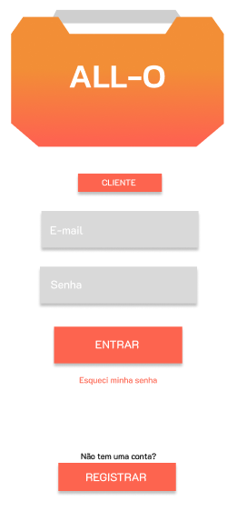
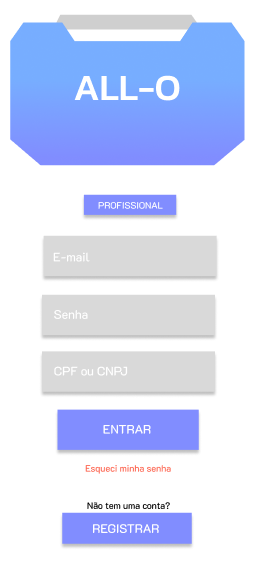

# ALL-O
- Para rodar este projeto siga os passos da configuração dada pela documentação do react-native. 
    >   Disponível em: https://reactnative.dev/docs/environment-setup?guide=native&package-manager=npm
- Recomenda-se utilizar uma versão >= 18 do node.js


## Após ter realizado toda a configuração, vá até a pasta raíz do projeto e rode os seguintes comandos no prompt de comando (shell):

> Este irá instalar todas as dependências necessárias
```properties
    npm install
```

> Irá iniciar o servidor metro
```properties
    npm start
``` 

> Após iniciar o metro, digite 'a' no console, para rodar no Android
```properties
    a
```
# Demonstração
Telas de login e navegação inicial:
- As telas de login serão separadas entre cliente e prestador de serviços
- Navegação em desenvolvimento
<table>
    <tr>
        <td>Cliente</td>
        <td>Prestador</td>
        <td>Navegação inicial</td>
    </tr>
    <tr>
        <td></td>
        <td></td>
        <td></td>
    </tr>
</table>